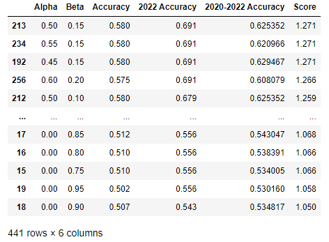
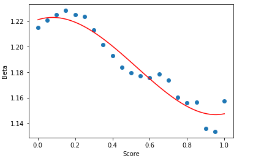

# Fantasy Football Manager Rating

## Project overview:
- Proposed a forecasting model for my fantasy football league that combines two Elo ratings with a weighted average and regresses to the mean at the beginning of each season.
- Used the [sleeper wrapper package](https://github.com/dtsong/sleeper-api-wrapper) to retrieve my league's data from sleeper's API
- Optimized the model for a combination of percentage of games predicted total and percentage of games predicted in the 2022 season using Scipy's curve fit function and analyzing scatterplots.
- Forecasted each matchup using the previous weeks data and analyzed the model using a calibration plot and Brier skill score.
- Imported data into a SQL database and used Azure Data Studio create a SQL notebook in which the data was queried to find interesting facts and answer interesting questions about the data. Some questions were "Which team gained the most ffmr in a single season?", "Which teams had the tough strength of schedule?", and "Which matchups had the highest combined ffmr?"

## Inspiration:
I’ve noticed, in my years of competing in fantasy football, that the same handful of managers tend to be at the top of the league every year. Although luck certainly plays its part in the outcomes of matchups, in my observation, success in fantasy football is highly correlated with the skill of the manager. And the US agrees with this observation; fantasy football has been legal in the country due to skill component even when sports betting was overwhelmingly illegal. The equation I came up with attempts to mitigate one specific factor of luck in fantasy football by weighing both performance vs opponent and performance vs median score of the league participants in that week. Opponent performance is something a manager has no control over, so taking performance vs median into account is a crucial part of my equation. It would be difficult to argue that a manager who consistently scores below the median and takes advantage of an easy schedule is somehow better than a manager that consistently scores above the median and is burdened with tough matchups. As for the importance of performance vs opponent, I have another example. Take, for instance, a manager who knows they are projected to lose their matchup. This manager will likely start a more volatile option who has the potential to “boom” than a consistent option who doesn’t have a “boom” in their range of outcomes. Additionally, the ultimate goal for a manager is to win their matchup, so this must be a point of emphasis in the rating.

## Goals
1. Find out the optimal balance of performance vs median and performance vs opponent and see which one is a better predictor of future outcomes. (α)

2. Find out how much manager success is affected by having to draft a new team at the beginning of each season. (β)

3. Find out if using FFMR to forecast outcomes is better than choosing outcomes at random (and by how much). (Brier skill score)

## Data Collection:
I used the [sleeper wrapper package](https://github.com/dtsong/sleeper-api-wrapper) to retrieve data from sleeper's API. 

## Equations:
Elo vs opponent:

Elo vs median:

Manager Rating:

In this equation, α is a number between 0 and 1 that is used to weigh either Elo more heavily. If α=1, only performance vs median is taken into account and if α=0, then only performance vs opponent is taken into account. We will be able to determine the more important factor by finding the optimal α.

Mean Regression Rate:

In this equation, β is a value between 0 and 1 that regresses each rating to the mean at the beginning of each season. I got this idea from [FiveThirtyEight’s NFL game predictions](https://fivethirtyeight.com/methodology/how-our-nfl-predictions-work/). A β value of 1 would mean that a manager's success in one season provides no indication of success in other seasons. A β value of 0 would mean that managers are completely unaffected by having to draft a new team at the beginning of each season. To give you some context, 538's NFL model has a mean regression rate of 1/3.

## Optimization:

After I saved all of the score and matchup data in csv files, I used a for loop to iterate through 441 different combinations of alphas and betas and decided I wanted to optimize for a combination of full league accuracy and 2022 accuracy. Note that accuracy is just the ratio of correctly predicted outcomes to total number of outcomes (the team with the higher rating won) and that the score column is simply Accuracy + 2022 Accuracy. I decided that I wanted to optimize for both the total league accuracy and the most recent season accuracy equally.
See [Accuracy and Optimization.ipynb](https://github.com/JohnBolger/FFMR/blob/main/Accuracy%20and%20Optimization.ipynb) for full code.

Here is a scatterplot showing the combinations of alpha and beta using color to show score:

This plot provided a clear range for the optimal parameters: α should be somewhere in the range (0.4,0.6) and β should be mewhere in the range (0.1,0.2). Also this shows that changes in β impact score more than changes in α.

I then used scipy's curve fit function to find more precise values for the optimal α and β.

This worked really well for Alpha and provided me with the optimal α of .5438, which is where the curve is at its maximum value:

Unfortunately, it wasn't that simple for Beta as I could not find a curve that was a good fit for the data:

However, I knew I that wanted to investigate the peak between β = .5 and β .15. So, I decided to run a loop with Alpha = .5538 and Beta in (.05,.15) incrementing by .01:

I came to the conclusion that the optimal β was between .11 and .12 and noticed that choosing any value in that range would not affect accuracy significantly, so I chose .12.

## Optimization Results:
The optimal value of α=.5438 shows a healthy balance of median performance and opponent performance and only indicates a slight median bias. My league is a pretty competitive 10 team (most of the time) PPR league and I can't imagine this value changing much with different leagues with the same settings, but maybe in standard leagues or leagues of different sizes.

The optimal β being equal to .12 shows that manager success doesn't change much from season to season; good managers make good decisions on a draft day and beyond and bad managers keep being bad (in my league). This seems obvious, but some people don't know about how much research goes into making good fantasy football decisions.

## Optimal Leagues Predictions
The percentage of correctly predicted games:

By Year:

The accuracy is being held back by 2019, the year in which we switched from 10 teams to 12 teams. After that season we went back to 10 teams, but the damage was done, my predictions were ruined. I can't wait to get more seasons in, so that I have enough data to just start from 2020. Nonetheless, the predictions seem to be getting better each year and I hope that trend continues.

By Week:

There doesn't seem to be too much of a pattern with the accuracy by week other than week 1 being the worst and the second half of the season being slightly more accurate, but both of those are to be expected.
 
## [Forecasting](https://github.com/JohnBolger/FFMR/blob/main/Optimal%20FFMR%20Forcasting.ipynb):
### Calibration plot

Now that I have my formula, I want to use it to forecast future events and test it going back and testing it on prior events. I will be using the datapoints from previous weeks to forecast a win probability for each week, i.e. I will use data from week 1 to forecast probabilities for week 2, data from weeks 1 and 2 to forecast week 3, and so on. 

This is a calibration plot, it shows whether events happened as often as my forecast predicted they would. The dotted red line shows what perfect forecasting would look like; the vertical red lines show 95% confidence intervals.

Plot for 2022:

### [Brier skill score](https://en.wikipedia.org/wiki/Brier_score#Brier_Skill_Score_(BSS)): (How much more value does our forecast provide compared to an unskilled forecast)

I used a loop to create 1000 random lists consisting of 1s and 0s to simulate randomly deciding each of the 401 outcomes and discovered that the Brier skill score for the league is .0634, which is close to [club soccer matches (.0668)](https://projects.fivethirtyeight.com/checking-our-work/club-soccer-matches/) and the [NHL games (.0687)](https://projects.fivethirtyeight.com/checking-our-work/nhl-games/) according to 538.

I did the same thing for the 2022 season and got a .1522 Brier skill score, which is better than the scores for every major team sport's games/matches, so I'm not sure what to make of this. It appears as though I need more data to make any reasonable conclusion. Although, it wouldn't surprise me is the true Brier score is even larger than this.

## Thanks to:
I was heavily inspired by FiveThirtyEight:
https://fivethirtyeight.com/ 

The use of sleeper wrapper made this project much easier:
https://github.com/dtsong/sleeper-api-wrapper

